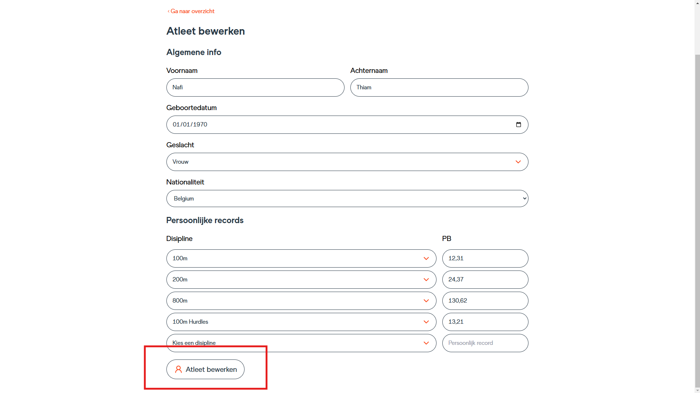

# Gebruikershandleiding Simurace

## Inhoudsopgave
- [Simurace opstarten](#simurace-opstarten)
- [Atleten](#atleten)
  - [Alle atleten bekijken](#alle-atleten-bekijken)
  - [Een atleet aanmaken](#een-atleet-aanmaken)
  - [Een atleet bewerken](#een-atleet-bewerken)
  - [Een atleet verwijderen](#een-atleet-verwijderen)
- [Simulaties](#simulaties)
  - [Alle simulaties bekijken](#alle-simulaties-bekijken)
  - [Een simulatie aanmaken](#een-simulatie-aanmaken)
  - [Een simulatie bewerken](#een-simulatie-bewerken)
  - [Een simulatie verwijderen](#een-simulatie-verwijderen)
  - [Simulaties afspelen](#simulaties-afspelen)
- [Instellingen wijzigen](#instellingen-wijzigen)
- [De PWA installeren](#de-pwa-installeren)

## Simurace opstarten
- **Development omgeving starten**: `npm run dev`
- **Demo omgeving starten**: `npm run start`
- Surf naar `localhost:5173` om de applicatie te openen.  
  
  Hier zie je een overzichtsscherm met navigatie naar simulaties, atleten en instellingen.

## Atleten

### Alle atleten bekijken
1. Klik bovenaan in de navigatie op **‘Atleten’**.  
   
2. Je krijgt een overzicht van alle atleten.

### Een atleet aanmaken
1. Ga naar het overzicht van atleten.
2. Klik rechtsboven op de knop **‘Atleet toevoegen’**.  
   
3. Vul gegevens in zoals naam, achternaam, geboortedatum, geslacht en nationaliteit.
   
4. Optioneel: voeg persoonlijke records toe door een discipline te kiezen en een tijd in seconden in te voeren.
   BV: als atleet een PB heeft van 2:12:53s moet je 132.53 invullen, heeft de atleet een PB van 43.55s moet je 43.55 invullen.
   
5. Klik onderaan op **‘Atleet toevoegen‘**.
   

### Een atleet bewerken
1. Ga naar de overzichtspagina van atleten.
2. Klik op het **potlood-icoon** naast de atleet die je wilt bewerken.  
   
3. Pas gegevens of persoonlijke records aan.
4. Klik op **‘Atleet bewerken’**.
   

### Een atleet verwijderen
1. Ga naar de overzichtspagina van atleten.
2. Klik op het **prullenbak-icoon** naast de atleet die je wilt verwijderen.  
   
3. Bevestig de verwijdering in de popup.
   

## Simulaties

### Alle simulaties bekijken
1. Klik bovenaan in de navigatie op **‘Simulaties’**.  
   
2. Je krijgt een overzicht van alle simulaties.

### Een simulatie aanmaken
1. Ga naar het overzicht van simulaties.
2. Klik rechtsboven op de knop **‘Simulatie toevoegen’**.  
   
3. Vul gegevens in zoals wedstrijdnaam en discipline.
   
4. Voeg atleten toe met een tijd in seconden.
   BV: als atleet 2:12:53s loop moet je 132.53 invullen, loopt de atleet 43.55s moet je 43.55 invullen.
   
5. Klik op **‘Simulatie aanmaken’**.
   

### Een simulatie bewerken
1. Ga naar de overzichtspagina van simulaties.
2. Klik op het **potlood-icoon** naast de simulatie die je wilt bewerken.  
   
3. Pas gegevens of atleten aan.
4. Klik op **‘Simulatie bewerken’**.
   

### Een simulatie verwijderen
1. Ga naar de overzichtspagina van simulaties.
2. Klik op het **prullenbak-icoon** naast de simulatie die je wilt verwijderen.  
   
3. Bevestig de verwijdering in de popup.
   

### Simulaties afspelen

#### Simulatie starten
1. Klik op het **play-icoon** naast een simulatie om deze af te spelen.  
   
2. Klik op **‘Simulatie starten’**.
   
3. De simulatie is gestart.

#### Simulatie pauseren
1. Klik op het **pauze-icoon** rechtsonder op het scherm.  
   *(Op mobiele apparaten staat dit icoon rechtsboven op het scherm.)*
   
2. De simulatie is gepauseerd.
3. Om de simulatie te hervatten, klik je op het **play-icoon**.
   

#### Simulatie herstarten
1. Klik op het **replay-icoon** rechtsonder op het scherm.  
   *(Op mobiele apparaten staat dit icoon rechtsboven op het scherm.)*
   
2. Klik op **‘Simulatie starten’**.
   
3. De simulatie is geherstart.

#### Simulatie stoppen
1. Klik op het **stop-icoon** rechtsonder op het scherm.  
   *(Op mobiele apparaten staat dit icoon rechtsboven op het scherm.)*
   
2. Klik op **‘Simulaties’**.
   
3. Je gaat terug naar het overzicht met alle simulaties.

## Instellingen wijzigen
1. Klik op **‘Instellingen’** in de navigatie.  
   
2. Pas instellingen aan door opties aan of uit te vinken.

## De PWA installeren
### In Google Chrome
1. Open de applicatie in Google Chrome.
2. Klik op het **installatie-icoon** rechts in de adresbalk.  
   
3. Volg de installatie-instructies.
   